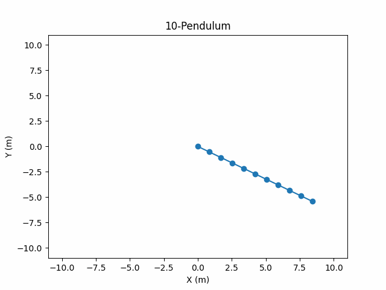
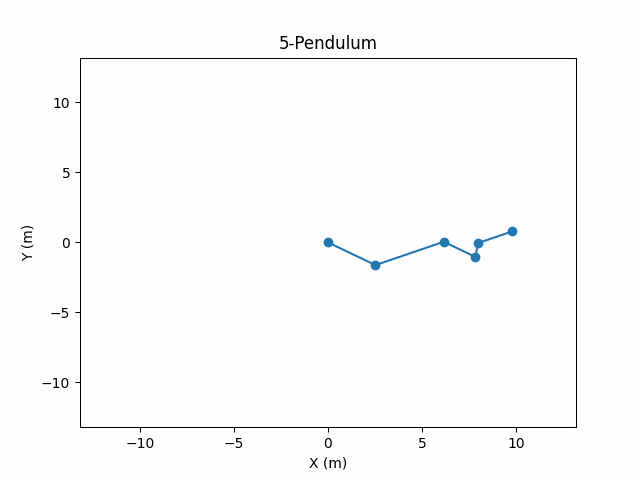

# n&ndash;Pendulum
### About
Python 3.11 project for simulating an n-pendulum, a physical system akin to a chain in which $n$ plane pendulums are linked together. It has no limitations on pendulum length or mass. For an explanation of the algorithm used see `n_pendulum.pdf`.

### Preview
  

### How to use
1. Clone the repository and open its folder from the CLI.
1. (Optional) Run the command `python -m venv venv` (or `python3 -m venv venv` if both Python 2 and Python 3 are installed on your computer) followed by `venv/Scripts/activate` to create a virtual environment in which to install dependencies.
1. Run the command `pip install -r requirements.txt` to install dependencies.
1. Run the command `python main.py` (or `python3 main.py` if both Python 2 and Python 3 are installed on your computer).
1. You will be prompted to fill in information about the simulation. Do so, pressing `enter` after typing the answer to each prompt.
1. Wait while the animation loads. The programme will open a Matplotlib window automatically.

NOTE: I would recommend simulating not many more than 20 bobs, as otherwise it might take quite long depending on your hardware (bear in mind you must also input the initial conditions for each bob). Weird initial conditions may make the simulation take longer. I would also recommend short simulations, around 10-20s.