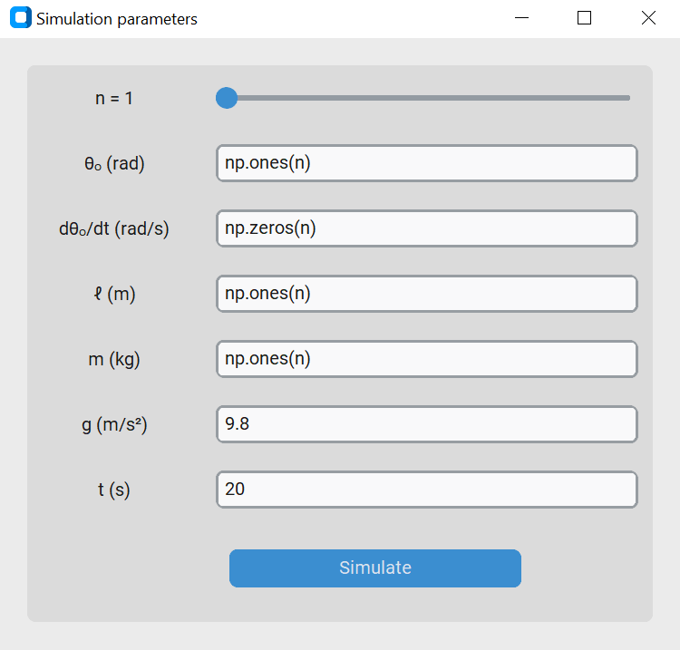

# n&ndash;Pendulum
### About
Python 3.11 project for simulating an n-pendulum, a physical system akin to a chain in which $n$ plane pendulums are linked together. The code can simulate any configuration of lengths and masses. For an explanation of the calculations performed see `n_pendulum.pdf`.

### Preview
  

### How to use
1. Clone the repository and open its folder from the CLI.
1. (Optional) Run the command `python -m venv venv` (or `python3 -m venv venv` if both Python 2 and Python 3 are installed on your computer) followed by `venv/Scripts/activate` to create a virtual environment in which to install dependencies.
1. Run the command `pip install -r requirements.txt` to install dependencies.
1. Run the command `python main.py` (or `python3 main.py` if both Python 2 and Python 3 are installed on your computer).
1. A GUI with some predefined values will open. Here you can modify the parameters of the simulation with Python and NumPy expressions. The initial angular displacement, velocity, length and mass of the pendulums should evaluate to 1D NumPy arrays. Gravity and duration should evaluate to ints or floats.

  

6. Wait while the animation loads. The programme will open a Matplotlib window automatically.

NOTE: I would recommend caution when it comes to simulating many bobs, weird initial conditions or long durations, as this may slow down the programme significantly.