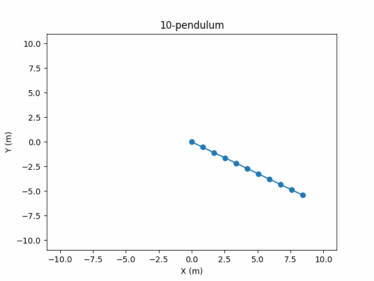

# N&ndash;Pendulum
### About
Python 3.11 project for simulating an n-pendulum, a physical system akin to a chain in which $n$ pendulums are linked together.

### Preview


### How to use
1. Clone the repository and open its folder from the CLI.
2. Run the command `pip install -r requirements.txt` to install dependencies.
3. Run the command `python main.py` (or `python3 main.py` if both Python 2 and Python 3 are installed on your computer).
4. You will be prompted to fill in information about the simulation. Do so, pressing `enter` after typing each value.
5. Wait while the animation loads. The programme will create `pendulum.gif` and open it automatically.

### Theory
Let's consider an n-pendulum with $n$ rods of length $l_i$ and $n$ bobs of mass $m_i$ linked together. Let's also take a cartesian coordinate axis centered at the anchor point of rod $1$, with an upward&ndash;directed $y$&ndash;axis. 

Notice that our system satisfies the Principle of Virtual Work, so we can apply the Lagrangian formalism. If we take our generalised coordinates $\theta_i$ to be the counterclockwise angle between each rod and the negative $y$ direction, the $(x_i,y_i)$ coordinates of each bob will be:

$$
\begin{align*}
x_1 &= l_1\sin\theta_1 & y_1 &= -l_1\cos\theta_1 \\
x_2 &= l_1\sin\theta_1+l_2\sin\theta_2 & y_2 &= -l_1\cos\theta_1-l_2\cos\theta_2 \\
\vdots & & \vdots &
\end{align*}
$$

$$
\begin{align*}
x_i &= \sum\limits_{j=1}^i l_j\sin\theta_j & y_i &= -\sum\limits_{j=1}^i l_j\cos\theta_j
\end{align*}
$$

The velocities of the $i^{th}$ bob are then:

$$
\begin{align*}
\dot{x}_i &= \sum\limits_{j=1}^i l_j\dot{\theta}_j\cos\theta_j & \dot{y}_i &= \sum\limits_{j=1}^i l_j\dot{\theta}_j\sin\theta_j
\end{align*}
$$

The kinetic energy of the system is thus:

$$
T = \frac{1}{2}\sum\limits_{i=1}^n m_i\left[
    \left(
        \sum\limits_{j=1}^i l_j\dot{\theta}_j\cos\theta_j
    \right)^2
    +
    \left(
        \sum\limits_{j=1}^i l_j\dot{\theta}_j\sin\theta_j
    \right)^2
\right]
$$

The potential energy will be:

$$
V = -g\sum\limits_{i=1}^n\sum\limits_{j=1}^i m_i l_j\cos\theta_j
$$

The Lagrangian for the n-pendulum is then $L=T-V$. Let's derive the Euler&ndash;Lagrange equations corresponding to this system:

$$
\frac{\partial L}{\partial\theta_k} =
\sum\limits_{i=k}^n m_i\left[
    -l_k\dot{\theta}_k\sin\theta_k\sum\limits_{j=1}^i l_j\dot{\theta}_j\cos\theta_j
    +
    l_k\dot{\theta}_k\cos\theta_k\sum\limits_{j=1}^i l_j\dot{\theta}_j\sin\theta_j
\right]
-g\sum\limits_{i=k}^n m_il_k\sin\theta_k
$$

$$
\frac{\partial L}{\partial\dot{\theta}_k}=
\sum\limits_{i=k}^n m_i\left[
    l_k\cos\theta_k\sum\limits_{j=1}^i l_j\dot{\theta}_j\cos\theta_j
    +
    l_k\sin\theta_k\sum\limits_{j=1}^i l_j\dot{\theta}_j\sin\theta_j
\right]
$$

$$
\begin{align*}
\frac{d}{dt}\frac{\partial L}{\partial\dot{\theta}_k}=
\sum\limits_{i=k}^n m_i\left[
    -l_k\dot{\theta}_k\sin\theta_k\sum\limits_{j=1}^i l_j\dot{\theta}_j\cos\theta_j
    +
    l_k\dot{\theta}_k\cos\theta_k\sum\limits_{j=1}^i l_j\dot{\theta}_j\sin\theta_j
\right]+ \\
+\sum\limits_{i=k}^n m_i
\left[
    l_k\cos\theta_k\sum\limits_{j=1}^i l_j(\ddot{\theta}_j\cos\theta_j-\dot{\theta}_j^2\sin\theta_j)
    +
    l_k\sin\theta_k\sum\limits_{j=1}^i l_j(\ddot{\theta}_j\sin\theta_j+\dot{\theta}_j^2\cos\theta_j)
\right]
\end{align*}
$$

We're thankfully going to get a lot of term cancellation:

$$
\frac{d}{dt}\frac{\partial L}{\partial\dot{\theta}_k}-\frac{\partial L}{\partial\theta_k}=
\sum\limits_{i=k}^n m_i l_k
\left[
    g\sin\theta_k+
    \cos\theta_k\sum\limits_{j=1}^i l_j(\ddot{\theta}_j\cos\theta_j-\dot{\theta}_j^2\sin\theta_j)
    +
    \sin\theta_k\sum\limits_{j=1}^i l_j(\ddot{\theta}_j\sin\theta_j+\dot{\theta}_j^2\cos\theta_j)
\right]=
$$

$$=
l_k \sum\limits_{i=k}^n m_i
\left[
    g\sin\theta_k+
    \sum\limits_{j=1}^i l_j(
        \ddot{\theta}_j\cos(\theta_k-\theta_j)+\dot{\theta}_j^2\sin(\theta_k-\theta_j)
        )
\right]=0
$$

Now our objective is to obtain an explicit system of $2^{nd}$ order ODEs to plug into an ODE solver. Let's start by separating terms:

$$
\sum\limits_{i=k}^n\sum\limits_{j=1}^i
m_i l_j\ddot{\theta}_j\cos(\theta_k-\theta_j)=
-g\sin\theta_k\sum\limits_{i=k}^n m_i
-\sum\limits_{i=k}^n\sum\limits_{j=1}^i m_il_j\dot{\theta}_j^2\sin(\theta_k-\theta_j)
$$

Our final trick is swapping the order of summation. This leaves us with:

$$
\sum\limits_{j=1}^n l_j\ddot{\theta}_j\cos(\theta_k-\theta_j)\sum\limits_{i=max(j,k)}^n m_i=
-g\sin\theta_k\sum\limits_{i=k}^n m_i
-\sum\limits_{i=k}^n l_j\dot{\theta}_j^2\sin(\theta_k-\theta_j)\sum\limits_{i=max(j,k)}^n m_i
$$

Finally! Notice this expression is linear in $\ddot{\theta}_j$. This means we only have to solve a linear system of equations (N.B.: the coefficients are clearly nonlinear). Let's see what it looks like: 

```math
\begin{pmatrix}
l_1\sum\limits_{i=1}^nm_i & l_2\cos(\theta_1-\theta_2)\sum\limits_{i=2}^nm_i & \cdots & l_n\cos(\theta_1-\theta_n)m_n \\
l_1\cos(\theta_2-\theta_1)\sum\limits_{i=2}^nm_i & l_2\sum\limits_{i=2}^nm_i & \cdots & l_n\cos(\theta_2-\theta_n)m_n \\
\vdots & \vdots & \ddots & \vdots \\
l_1\cos(\theta_n-\theta_1)m_n & l_1\cos(\theta_n-\theta_2)m_n & \cdots & l_nm_n
\end{pmatrix}
\begin{pmatrix}
\ddot{\theta}_1 \\[1em]
\ddot{\theta}_2 \\
\vdots \\[.5em]
\ddot{\theta}_n 
\end{pmatrix}
=
```

```math
=-g\begin{pmatrix}
\sin\theta_1\sum\limits_{i=1}^n m_i \\
\sin\theta_2\sum\limits_{i=2}^n m_i \\
\vdots \\
\sin\theta_n m_n
\end{pmatrix}
-\begin{pmatrix}
0 & l_2\sin(\theta_1-\theta_2)\sum\limits_{i=2}^nm_i & \cdots & l_n\sin(\theta_1-\theta_n)m_n \\
l_1\sin(\theta_2-\theta_1)\sum\limits_{i=2}^nm_i & 0 & \cdots & l_n\sin(\theta_2-\theta_n)m_n \\
\vdots & \vdots & \ddots & \vdots \\
l_1\sin(\theta_n-\theta_1)m_n & l_1\sin(\theta_n-\theta_2)m_n & \cdots & 0
\end{pmatrix}
\begin{pmatrix}
\dot{\theta}_1^2 \\[1em]
\dot{\theta}_2^2 \\
\vdots \\[.5em]
\dot{\theta}_n^2 
\end{pmatrix}
```

We can represent this system of equations as follows:

$$
A\ddot{\vec{\theta}} = -g\vec{c}-B\dot{\vec{\theta}^2}
$$

And we can obtain the following explicit formula for $\ddot{\vec{\theta}}$:

$$
\ddot{\vec{\theta}} = -A^{-1}\left(g\vec{c}+B\dot{\vec{\theta}^2}\right)
$$

This last step, as well as the solution to the system of ODEs will be calculated numerically.